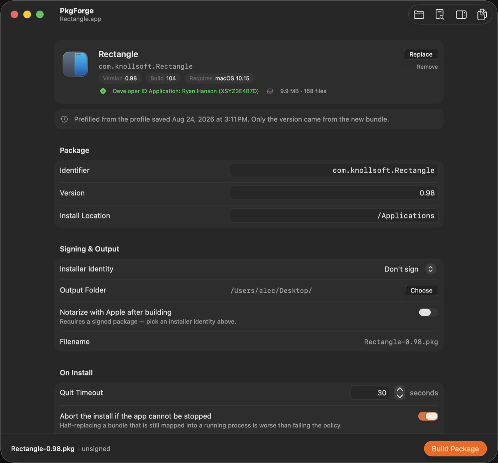

# PkgForge

Turns a dropped `.app` into a signed, Jamf-ready installer `.pkg` with
generated pre/postinstall cleanup scripts — and, optionally, notarizes it and
uploads it straight into Jamf Pro.

macOS 26, SwiftUI, no `sudo`, no privileged helper.



## Build and run

```
xcodegen generate
open PkgForge.xcodeproj
```

`project.yml` is the source of truth; the `.xcodeproj` is generated and
gitignored. `scripts/release.sh` produces a distributable `.pkg` in `dist/`,
signing with whatever Developer ID identities are in the keychain and
notarizing too if a `notarytool` keychain profile exists.

### App Sandbox is off, deliberately

PkgForge shells out to `/usr/bin/pkgbuild`, `/usr/bin/ditto`,
`/usr/bin/codesign`, `/usr/bin/security` and `/usr/sbin/pkgutil`. A sandboxed
process cannot exec any of them, so the entitlement is `false` and
`scripts/release.sh` fails the release if a build ever comes out sandboxed.
Hardened Runtime stays on.

## What it does

1. **Drop an app.** The whole window is a drop target, and a replacement is
   accepted at any point. `Info.plist` is parsed with
   `PropertyListSerialization`, so binary plists work. A bundle with no
   `CFBundleIdentifier` is rejected rather than given a synthesised one — a
   wrong identifier makes the package a silent upgrade of something else.
2. **Adjust the form.** Identifier, version, install location, quit timeout,
   the two stale-path lists, your own script additions, the signing identity
   and the output folder. Paths support `${BUNDLE_ID}` and `${APP_NAME}`.
3. **Build.** Payload staged with `ditto`, scripts written at mode `0755`,
   `pkgbuild --ownership recommended`, then `pkgutil --check-signature` and
   `--payload-files` for verification. Tool output streams into the log
   inspector as it happens; failures show `pkgbuild`'s own stderr. Copy
   progress is real — counted from `ditto -V` against the file count from the
   bundle walk, so a multi-gigabyte app does not sit at 10% for minutes.
4. **Notarize and upload** (both optional). See below.

**Preview Scripts** in the toolbar shows exactly what will run as root on every
managed Mac, before you build.

## Generated scripts

The preinstall matches the running app by the executable path it was launched
from (`pgrep -f` on `<install-location>/<AppName>.app/Contents/MacOS/`), not by
process name — names truncate at 15 characters and collide. It asks the console
user to quit via `launchctl asuser … osascript`, polls to the timeout, then
escalates `SIGTERM` → `SIGKILL`. If the app is still there and "abort if it
cannot be stopped" is on, it exits 1 so the Jamf policy fails: half-replacing a
bundle that is still mapped into a running process is worse than failing.

LaunchDaemons and LaunchAgents named in the cleanup lists are `launchctl
bootout`ed before their plists are deleted. Agents are unloaded from every
local account's GUI session, not just the console user's, so fast user
switching does not leave one running.

Per-user paths are applied across `/Users/*`, skipping `Shared`, `Guest` and
dot-directories.

"Remove stray copies" is **off by default** and stays that way deliberately: it
is the only option that can delete something outside the install location. It
searches `/Applications` and every user's `~/Applications` two levels deep for a
bundle with a matching *filename*, so PkgForge checks each hit's
`CFBundleIdentifier` against the package's before deleting it — two unrelated
vendors ship a `Console.app`, and a filename match alone is not evidence of
identity.

The postinstall sets `root:wheel`, strips group/other write, clears
`com.apple.quarantine`, and verifies the code signature (warning only).

### The install location is pinned

Left to itself `pkgbuild` writes a `<relocate>` block into the package. At
install time the installer looks the bundle identifier up on the target Mac and,
if it finds an existing copy somewhere other than the install location — a
user's `~/Applications`, `/Applications/Utilities`, an old copy on another
volume — it puts the payload *there* instead.

For a managed deployment that is never what was meant, and with these scripts it
is actively harmful: the preinstall has already removed the app from the install
location, and the postinstall then finds nothing where it expects and fails the
policy while the payload sits somewhere else entirely.

So PkgForge runs `pkgbuild --analyze`, sets `BundleIsRelocatable` to false for
every component, and passes the result back via `--component-plist`. The
resulting package carries an empty `<relocate/>`. The **Always install to the
location above** toggle turns this off for the rare case where relocation is
wanted; the postinstall then downgrades its missing-bundle check to a warning,
because the bundle legitimately may be elsewhere.

### Additional scripts

A flat package declares its script phases in `PackageInfo`, and `pkgbuild`
emits exactly two:

```xml
<scripts>
    <preinstall file="./preinstall" timeout="600"/>
    <postinstall file="./postinstall" timeout="600"/>
</scripts>
```

`preflight`, `postflight`, `preupgrade` and `postupgrade` are pre-10.5
bundle-package phases. Nothing in a modern flat package declares them and
`installer` never runs them, so PkgForge does not pretend to offer them.
Anything extra goes *inside* the two real scripts:

- **Preinstall additions** — your own bash, placed either before the app is
  stopped or after all cleanup, just before the script exits.
- **Postinstall additions** — placed after ownership, permissions and
  quarantine are corrected, before the signature check.
- **Bundled files** — copied into the package's `Scripts` directory. macOS
  never runs them; your additions call them as
  `"$(/usr/bin/dirname "$0")/name"`. Anything starting with `#!` gets mode
  755, everything else 644. A file named `preinstall` or `postinstall` is
  rejected rather than allowed to replace the generated one.

`$APP_NAME`, `$BUNDLE_ID`, `$APP_PATH`, `$INSTALL_LOCATION`, `$CONSOLE_USER`,
`$CONSOLE_UID` and `log()` are all in scope for your snippets.

Because those snippets are code rather than data they are spliced in verbatim,
so the build runs `/bin/bash -n` over both finished scripts and **fails** if
either is not valid bash. An unbalanced quote stops the build instead of
producing a package that installs fine everywhere and silently does nothing.

Every interpolated value is shell-escaped, regex-escaped for `pgrep`, or
glob-escaped for `find`, as appropriate. An app called `Bob's Test App.app`
produces valid, non-injectable bash — there is a test for it.

## Signing

The picker only lists **Developer ID Installer** identities. An application
identity produces a package macOS refuses to install, so it must never be
selectable.

Identities are selected by **SHA-1 fingerprint, never by common name**. A team
that has reissued a certificate has two in the keychain with identical names,
and `codesign` refuses the ambiguous match outright:

```
Developer ID Installer: Example Corp (AB12CD34EF): ambiguous
(matches "Developer ID Installer: …" and "Developer ID Installer: …")
```

The picker therefore labels each identity with its expiry date — the only thing
telling two certificates for the same team apart — sorts the longest-lived
first, and flags one within 90 days of expiry. `scripts/release.sh` resolves
identities the same way, preferring the certificate that expires last rather
than whichever the keychain happened to list first.

Signing at all is optional: a package Jamf installs as root deploys fine
unsigned, because an MDM-driven install does not consult Gatekeeper. It matters
when someone might double-click the package by hand.

### The payload is checked for debug builds

Xcode injects `com.apple.security.get-task-allow` — the entitlement that lets a
debugger attach — into any build with base entitlements injected, **Release
included** unless `CODE_SIGN_INJECT_BASE_ENTITLEMENTS` is turned off. Apple's
notary service rejects every executable carrying it, so a package built from
such an app can be signed and can never be notarized.

PkgForge reads the dropped bundle's entitlements and says so up front: a
warning normally, a blocking error when notarization is on. It also checks for
Hardened Runtime, which notarization equally requires. `scripts/release.sh`
refuses to ship a release carrying either fault.

## Notarization

Off by default, and unavailable until an installer identity is chosen — an
unsigned package cannot be notarized.

It needs a `notarytool` keychain profile, created once per Mac. PkgForge cannot
create this for you; it takes an Apple ID and an app-specific password:

```bash
xcrun notarytool store-credentials pkgforge-notary \
  --apple-id you@example.com \
  --team-id ABCDE12345
```

Name that profile in the form and press **Verify**, which checks it resolves
before a build rather than after several minutes of waiting on Apple. Then:

- The package is submitted and PkgForge waits for a verdict.
- On acceptance the ticket is stapled, validated, and `spctl`'s assessment is
  logged.
- On rejection the notary log is fetched and shown — the verdict alone never
  says what was wrong.

A rejection fails the build but **never deletes the package**. It is built and
signed, and still deployable via Jamf; only the notarization is missing.

## Jamf Pro upload

Optional. Nothing about building a package requires it.

### Saved logins

Settings → **Jamf Pro** stores as many instances as you like and switches
between them, with Connect, Edit and Remove on each row. Credentials live in
the login Keychain, keyed by URL + auth mode + account; only the non-secret
parts are in `UserDefaults`. **Test Connection** validates before saving.

Two auth modes:

- **API Client** (preferred) — Settings → System → API Roles and Clients. The
  role needs **Create**, **Read** and **Update** on *Packages*, plus **Read** on
  *Categories*.
- **Jamf Pro Account** — username and password, exchanged for a bearer token.

### Uploading

After a successful build, **Upload to Jamf Pro** opens a sheet with the package
record fields: display name, category, priority, info, notes, reboot required
and the suppression flags.

The upload uses the Jamf Pro API: `POST /v1/packages` to create or
`PUT /v1/packages/{id}` to update, then `POST /v1/packages/{id}/upload`. The
multipart body is staged to a temp file and streamed from disk, so a
multi-gigabyte package is not held in memory, and a SHA-256 computed during
that pass is sent with the record. Progress is reported live and the upload can
be stopped in flight.

Collisions are checked on **both** `fileName` and `packageName` before anything
is sent. The second is a hard constraint: Jamf Pro requires package display
names to be unique and rejects the POST with `DUPLICATE_FIELD` otherwise, so
checking only the filename let that rejection through as a raw HTTP 400. When a
collision exists you get the choice to replace that record or create a new one
— and creating a new one is blocked until the display name differs, because the
server would refuse it.

If an upload fails partway after creating a record, that record is deleted
again. A package record with no file behind it is worse than none: it looks
usable and fails every policy that scopes it.

Jamf Pro's error envelope is decoded rather than dumped: `code` and `field`
become a sentence you can act on, with the raw body kept underneath for
copying.

**This needs Jamf Pro 11.5 or later**, with a cloud distribution point as the
principal DP. Older instances have no upload endpoint; you get a clear error
rather than a hang.

Metadata from a successful upload is remembered per bundle identifier and
prefilled next time.

## Profiles and defaults

After each successful build the configuration is saved to
`~/Library/Application Support/PkgForge/Profiles/<bundleID>.json`. Dropping the
same app again prefills everything from it and takes **only** the version from
the new bundle. The cleanup path lists are the only part of this that requires
real thought and they do not change between versions — persisting them is what
makes the second build a two-click operation. Settings → **Profiles** lists
them with a Delete button on each row.

Settings → **General** sets what a *new* app starts from when it has no saved
profile: install location, output folder, quit timeout, the toggles and the
default per-user cleanup paths. An app you have built before comes back from
its profile and is unaffected by anything there.

Profiles are decoded field by field with defaults for anything missing, so
adding a setting to a later version cannot silently erase the profiles already
on disk.

## Help

**Help → PkgForge Help** opens a nine-topic help book covering what gets read
from the bundle, what the generated scripts do, the cleanup lists, additional
scripts, signing, notarization, Jamf Pro setup, profiles and troubleshooting.
The Help menu also has **Show the Installer Log**, which opens this Mac's
`/var/log/install.log` — the same file the generated scripts write to on a
target Mac.

## Two deliberate design decisions

- **Filename sanitising keeps dots in the version.** Reducing a filename to
  letters, digits, hyphen and underscore turns `2.1.0` into `2-1-0`, which
  makes the package unrecognisable downstream for no safety gain — a dot is
  inert in a filename. The app *name* is reduced to that set; the *version*
  additionally keeps dots. Leading dots and `..` are still stripped.
- **The postinstall exits non-zero if the installed bundle is missing.**
  Reaching that point means ownership was never corrected on a bundle in
  `/Applications`, which is the privilege-escalation case the `chown` exists to
  close — so it fails the policy rather than reporting success.

## Test status

Verified against a fixture app named `Bob's Test App.app` — apostrophe, space,
binary `Info.plist`, `CFBundleName` deliberately different from the filename —
plus real apps from `/Applications`.

✅ verified · 🟡 partly verified · ⬜ not yet run

| Acceptance test | Status |
| --- | --- |
| 1. Signed third-party app populates correctly | ✅ `codesign --display` parsing, against real signed apps |
| 2. Binary `Info.plist` parses | ✅ |
| 3. Scripts reference the on-disk filename, not the display name | ✅ |
| 4. Non-app folder and `.dmg` rejected cleanly | ✅ |
| 5. `pkgutil --check-signature` unsigned, then signed | ✅ both — the signed package reports a full Developer ID Installer chain with a trusted timestamp |
| 6. Graceful quit of a running app | 🟡 the quit, escalation and cleanup were executed for real against a sandboxed install location, but not as a root install with an unsaved document |
| 7. Escalation ladder on a `SIGSTOP`ped app | 🟡 verified to the `SIGTERM` rung — a stopped process is still terminated by `SIGTERM`, so the `SIGKILL` rung and the `exit 1` abort cannot be provoked without an unkillable process |
| 8. Installed bundle is `root:wheel`, no quarantine | ⬜ needs a real install as root |
| 9. Bogus stale path deleted and logged | ✅ |
| 10. Second build prefills saved cleanup lists | ✅ profile round-trip, including decoding a profile written before the newer fields existed |
| 11. Apostrophe + space produce valid bash | ✅ `bash -n`, plus execution |

Beyond the acceptance list: relocation is confirmed off on a real multi-bundle
app; a broken operator snippet is confirmed to fail the build rather than ship;
stray-copy identity checking is confirmed against a same-filename decoy with a
different bundle identifier; and the Jamf error parser is confirmed against a
real `DUPLICATE_FIELD` response.

The Jamf Pro upload has been run successfully against a live server, so the
package record fields and the upload endpoint are confirmed. Not yet exercised
there: the rollback path when an upload fails partway, and cancelling an upload
in flight.

Notarization failure handling is tested — unsigned-but-requested warns and
still builds, a bad profile fails with a clear message and leaves the signed
package intact. The **success** path is untested; it needs a real notarytool
profile.

## Known gaps

- No package has been installed as root on a test Mac (acceptance tests 6
  and 8).
- Notarization has never completed successfully end to end.
- Queueing several dropped bundles is not implemented; extra items in a
  multi-drop are ignored with a notice.
- VoiceOver and keyboard navigation have not been checked.

Deliberately not attempted: `productbuild` distribution packages, end-user
prompting UI (that belongs in a Jamf Files and Processes payload, not in the
package), and signing the `.app` itself — PkgForge packages what it is given.
